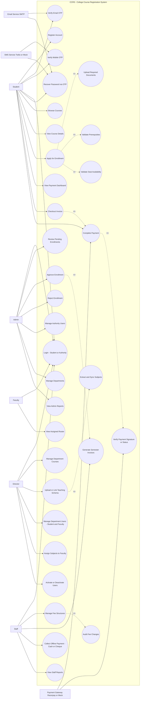

# Whole System Use-Case Diagram

```mermaid
flowchart LR
  Student[Student]
  Admin[Admin]
  Director[Director]
  Staff[Staff]
  Faculty[Faculty]
  SMTP[Email Service SMTP]
  SMS[SMS Service Twilio or Mock]
  PG[Payment Gateway Razorpay or Mock]

  subgraph CCRS[CCRS - College Course Registration System]
    UC_Register((Register Account))
    UC_VerifyEmail((Verify Email OTP))
    UC_VerifyMobile((Verify Mobile OTP))
    UC_Login((Login - Student or Authority))
    UC_ForgotReset((Recover Password via OTP))

    UC_Browse((Browse Courses))
    UC_CourseDetail((View Course Details))
    UC_Apply((Apply for Enrollment))
    UC_UploadDocs((Upload Required Documents))
    UC_Prereq((Validate Prerequisites))
    UC_Seat((Validate Seat Availability))
    UC_PayDash((View Payment Dashboard))
    UC_Checkout((Checkout Invoice))
    UC_Payment((Complete Payment))
    UC_PaymentVerify((Verify Payment Signature or Status))

    UC_ReviewEnroll((Review Pending Enrollments))
    UC_Approve((Approve Enrollment))
    UC_Reject((Reject Enrollment))
    UC_AdminUsers((Manage Authority Users))
    UC_Departments((Manage Departments))
    UC_AdminReports((View Admin Reports))

    UC_Courses((Manage Department Courses))
    UC_Schema((Upload or Link Teaching Schema))
    UC_SubjectSync((Extract and Sync Subjects))
    UC_DirUsers((Manage Department Users - Student and Faculty))
    UC_Assign((Assign Subjects to Faculty))
    UC_UserState((Activate or Deactivate Users))

    UC_Fee((Manage Fee Structures))
    UC_FeeAudit((Audit Fee Changes))
    UC_InvoiceGen((Generate Semester Invoices))
    UC_OfflinePay((Collect Offline Payment - Cash or Cheque))
    UC_StaffReports((View Staff Reports))

    UC_Roster((View Assigned Roster))
  end

  Student --> UC_Register
  Student --> UC_VerifyEmail
  Student --> UC_VerifyMobile
  Student --> UC_Login
  Student --> UC_ForgotReset
  Student --> UC_Browse
  Student --> UC_CourseDetail
  Student --> UC_Apply
  Student --> UC_PayDash
  Student --> UC_Checkout
  Student --> UC_Payment

  Admin --> UC_Login
  Admin --> UC_ReviewEnroll
  Admin --> UC_Approve
  Admin --> UC_Reject
  Admin --> UC_AdminUsers
  Admin --> UC_Departments
  Admin --> UC_AdminReports

  Director --> UC_Login
  Director --> UC_Courses
  Director --> UC_Schema
  Director --> UC_DirUsers
  Director --> UC_Assign
  Director --> UC_UserState

  Staff --> UC_Login
  Staff --> UC_Fee
  Staff --> UC_InvoiceGen
  Staff --> UC_OfflinePay
  Staff --> UC_StaffReports

  Faculty --> UC_Login
  Faculty --> UC_Roster

  SMTP --> UC_VerifyEmail
  SMTP --> UC_ForgotReset
  SMS --> UC_VerifyMobile
  SMS --> UC_ForgotReset
  PG --> UC_Payment
  PG --> UC_PaymentVerify

  UC_Apply -. "<<include>>" .-> UC_UploadDocs
  UC_Apply -. "<<include>>" .-> UC_Prereq
  UC_Apply -. "<<include>>" .-> UC_Seat
  UC_Checkout -. "<<include>>" .-> UC_Payment
  UC_Payment -. "<<include>>" .-> UC_PaymentVerify
  UC_Schema -. "<<include>>" .-> UC_SubjectSync
  UC_Fee -. "<<include>>" .-> UC_FeeAudit
  UC_Approve -. "<<extend>>" .-> UC_InvoiceGen
```
