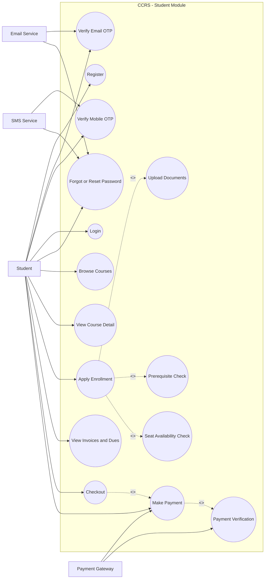

# Student Use-Case Diagram

```mermaid
flowchart LR
  Student[Student]
  SMTP[Email Service]
  SMS[SMS Service]
  PG[Payment Gateway]

  subgraph StudentModule[CCRS - Student Module]
    U1((Register))
    U2((Verify Email OTP))
    U3((Verify Mobile OTP))
    U4((Login))
    U5((Forgot or Reset Password))
    U6((Browse Courses))
    U7((View Course Detail))
    U8((Apply Enrollment))
    U9((Upload Documents))
    U10((Prerequisite Check))
    U11((Seat Availability Check))
    U12((View Invoices and Dues))
    U13((Checkout))
    U14((Make Payment))
    U15((Payment Verification))
  end

  Student --> U1
  Student --> U2
  Student --> U3
  Student --> U4
  Student --> U5
  Student --> U6
  Student --> U7
  Student --> U8
  Student --> U12
  Student --> U13
  Student --> U14

  U8 -. "<<include>>" .-> U9
  U8 -. "<<include>>" .-> U10
  U8 -. "<<include>>" .-> U11
  U13 -. "<<include>>" .-> U14
  U14 -. "<<include>>" .-> U15

  SMTP --> U2
  SMTP --> U5
  SMS --> U3
  SMS --> U5
  PG --> U14
  PG --> U15
```

