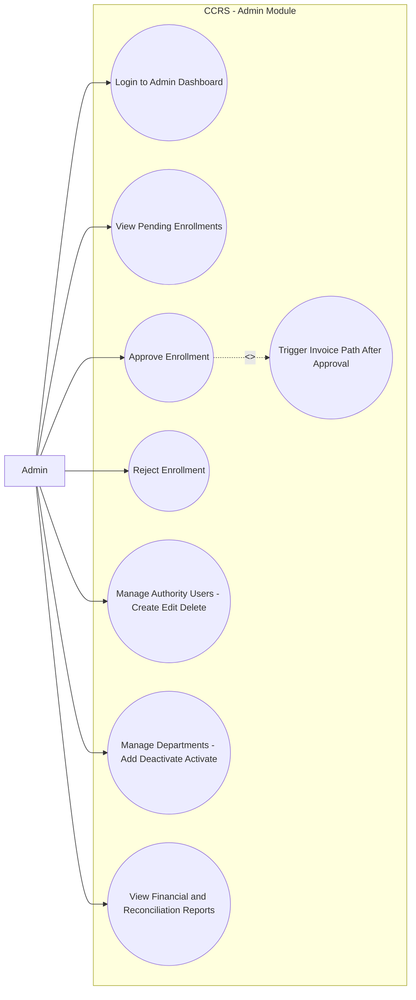

# Admin Use-Case Diagram

```mermaid
flowchart LR
  Admin[Admin]

  subgraph AdminModule[CCRS - Admin Module]
    A1((Login to Admin Dashboard))
    A2((View Pending Enrollments))
    A3((Approve Enrollment))
    A4((Reject Enrollment))
    A5((Manage Authority Users - Create Edit Delete))
    A6((Manage Departments - Add Deactivate Activate))
    A7((View Financial and Reconciliation Reports))
    A8((Trigger Invoice Path After Approval))
  end

  Admin --> A1
  Admin --> A2
  Admin --> A3
  Admin --> A4
  Admin --> A5
  Admin --> A6
  Admin --> A7

  A3 -. "<<extend>>" .-> A8
```

