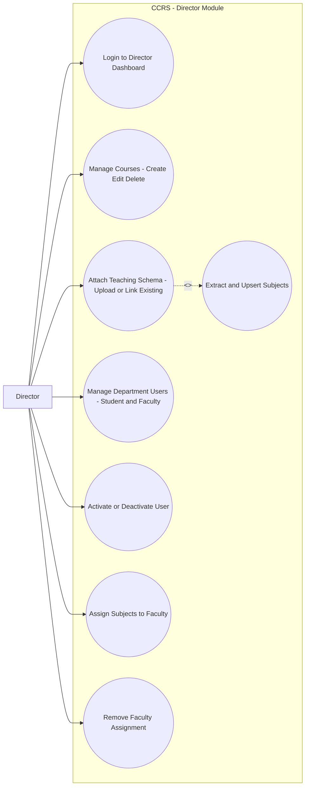

# Director Use-Case Diagram

```mermaid
flowchart LR
  Director[Director]

  subgraph DirectorModule[CCRS - Director Module]
    D1((Login to Director Dashboard))
    D2((Manage Courses - Create Edit Delete))
    D3((Attach Teaching Schema - Upload or Link Existing))
    D4((Extract and Upsert Subjects))
    D5((Manage Department Users - Student and Faculty))
    D6((Activate or Deactivate User))
    D7((Assign Subjects to Faculty))
    D8((Remove Faculty Assignment))
  end

  Director --> D1
  Director --> D2
  Director --> D3
  Director --> D5
  Director --> D6
  Director --> D7
  Director --> D8

  D3 -. "<<include>>" .-> D4
```

