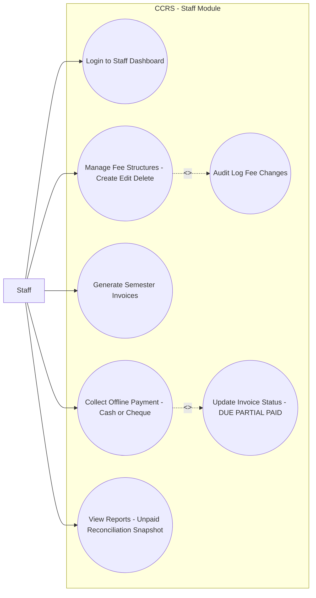

# Staff Use-Case Diagram

```mermaid
flowchart LR
  Staff[Staff]

  subgraph StaffModule[CCRS - Staff Module]
    S1((Login to Staff Dashboard))
    S2((Manage Fee Structures - Create Edit Delete))
    S3((Audit Log Fee Changes))
    S4((Generate Semester Invoices))
    S5((Collect Offline Payment - Cash or Cheque))
    S6((Update Invoice Status - DUE PARTIAL PAID))
    S7((View Reports - Unpaid Reconciliation Snapshot))
  end

  Staff --> S1
  Staff --> S2
  Staff --> S4
  Staff --> S5
  Staff --> S7

  S2 -. "<<include>>" .-> S3
  S5 -. "<<include>>" .-> S6
```

