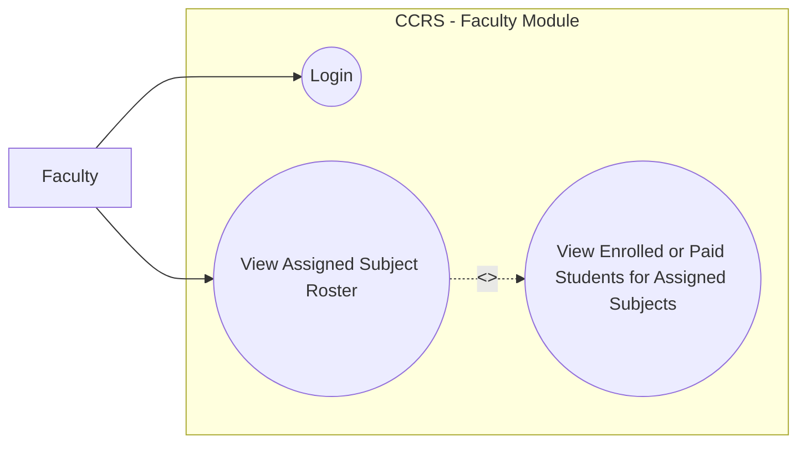

# Faculty Use-Case Diagram

```mermaid
flowchart LR
  Faculty[Faculty]

  subgraph FacultyModule[CCRS - Faculty Module]
    F1((Login))
    F2((View Assigned Subject Roster))
    F3((View Enrolled or Paid Students for Assigned Subjects))
  end

  Faculty --> F1
  Faculty --> F2
  F2 -. "<<include>>" .-> F3
```

